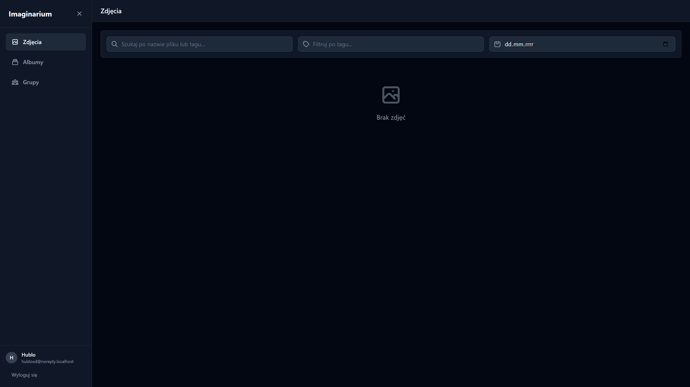
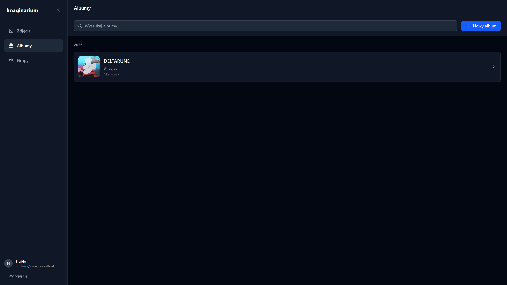
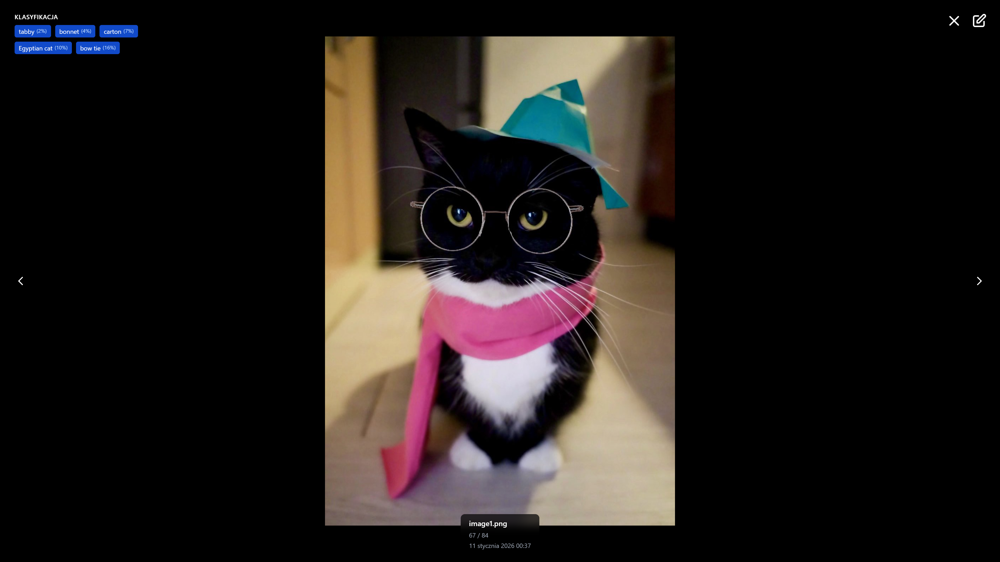
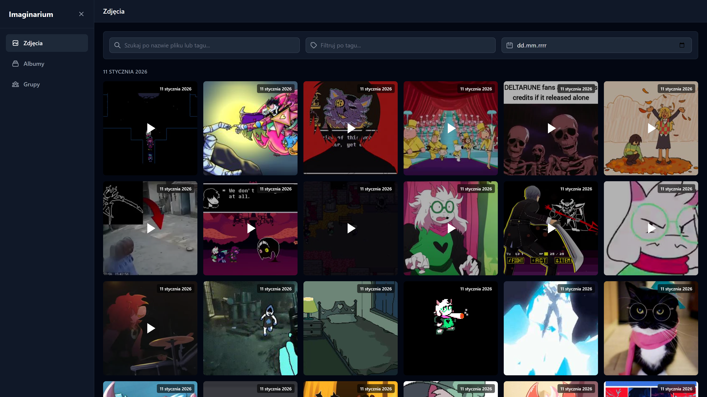

# Imaginarium

Aplikacja Imaginarium to galeria zdjęć i filmów, stworzona z myślą o użytkownikach, którzy chcą przechowywać, organizować i udostępniać swoje multimedialne wspomnienia w bezpieczny sposób na własnej infrastrukturze. Celem projektu jest zbudowanie funkcjonalnej platformy umożliwiającej zarządzanie kolekcją zdjęć i filmów z automatyczną klasyfikacją treści oraz elastycznym systemem udostępniania.

## Zrzuty ekranu









## Główne funkcjonalności

- **System użytkowników** – rejestracja i logowanie użytkowników z autoryzacją i uwierzytelnianiem (JWT)
- **Zarządzanie multimediami** – przesyłanie, przeglądanie, edycja i usuwanie zdjęć oraz filmów
- **Albumy** – tworzenie i organizowanie albumów tematycznych ze zdjęciami i filmami
- **Udostępnianie treści** – możliwość udostępniania albumów i pojedynczych plików innym użytkownikom (zarówno zarejestrowanym, jak i poprzez linki publiczne)
- **Automatyczne tagowanie** – klasyfikacja zdjęć przez sztuczną inteligencję (np. krajobraz, zwierzę, osoba, budynek)
- **Wyszukiwanie** – zaawansowane wyszukiwanie po tagach, datach, albumach i metadanych
- **Podgląd i miniaturki** – automatyczne generowanie miniatur dla zdjęć i filmów (ffmpeg)

## Architektura

### Wzorzec architektoniczny
Mikroserwisy z separacją front-end i back-end

### Stack technologiczny

1. **Backend**: Django 5.x + Django REST Framework
2. **Frontend**: Angular + Tailwind CSS
3. **Baza danych**: PostgreSQL
4. **Mikroserwis AI**: Serwis klasyfikujący z wykorzystaniem modeli ML (TensorFlow, PyTorch) - FastAPI
5. **Kolejka zadań**: Celery + Redis dla asynchronicznego przetwarzania multimediów
6. **Kontenery**: Docker + Docker Compose dla łatwego wdrożenia
7. **Reverse Proxy**: Nginx

## Struktura projektu

```
Imaginarium/
├── deployment/              # Konfiguracja Docker Compose i Nginx
│   ├── docker-compose.yml
│   ├── nginx.conf
│   └── env/
│       ├── imaginarium.env
│       └── postgres.env
├── src/
│   ├── django/
│   │   └── imaginarium/    # Backend API (Django)
│   │       ├── accounts/    # Zarządzanie użytkownikami
│   │       ├── albums/      # Zarządzanie albumami
│   │       ├── media_app/   # Zarządzanie mediami
│   │       ├── groups/      # Zarządzanie grupami
│   │       ├── sharing/     # System udostępniania
│   │       └── tags/        # Tagi (deprecated)
│   ├── angular/
│   │   └── imaginarium-front/      # Frontend (Angular)
│   └── fastapi/
│       └── ai-classification/      # Mikroserwis AI (FastAPI)
└── README.md
```

## Wymagania

- Docker i Docker Compose
- Git

## Instalacja i uruchomienie

1. Przejdź do katalogu deployment:
```bash
cd deployment
```

2. Utwórz pliki konfiguracyjne środowiska:
   - `env/imaginarium.env` - konfiguracja backendu Django
   - `env/postgres.env` - konfiguracja bazy danych PostgreSQL

   Przykładowa zawartość `env/imaginarium.env`:
   ```
   DEBUG=True
   SECRET_KEY=your-secret-key-here
   DB_NAME=imaginarium
   DB_USER=postgres
   DB_PASS=postgres
   DB_HOST=postgres
   DB_PORT=5432
   CELERY_BROKER_REDIS_URL=redis://redis:6379/0
   CACHE_REDIS_URL=redis://redis:6379/1
   AI_CLASSIFICATION_URL=http://ai-classification:8000
   ```

   Przykładowa zawartość `env/postgres.env`:
   ```
   POSTGRES_USER=postgres
   POSTGRES_PASSWORD=postgres
   POSTGRES_DB=imaginarium
   ```

3. Uruchom aplikację za pomocą Docker Compose:
```bash
docker-compose up -d
```

4. Wykonaj migracje bazy danych (jeśli potrzebne):
```bash
docker-compose exec imaginarium python manage.py migrate
```

## Dostęp do serwisów

Po uruchomieniu aplikacja będzie dostępna pod następującymi adresami:

- **Frontend**: http://localhost:8080
- **Backend API**: http://localhost:8000
- **Mikroserwis AI**: http://localhost:8001
- **Nginx (Reverse Proxy)**: http://localhost:4444
- **Swagger UI**: http://localhost:4444/api/schema/swagger-ui/
- **ReDoc**: http://localhost:4444/api/schema/redoc/
- **OpenAPI JSON**: http://localhost:4444/api/schema/openapi.json

## Konfiguracja

### Zmienne środowiskowe

Aplikacja wymaga skonfigurowania następujących plików środowiskowych w katalogu `deployment/env/`:

- `imaginarium.env` - konfiguracja aplikacji backend Django (np. connection strings, secrets, Redis, AI service URL)
- `postgres.env` - konfiguracja bazy danych PostgreSQL (POSTGRES_USER, POSTGRES_PASSWORD, POSTGRES_DB)

## Zatrzymywanie aplikacji

Aby zatrzymać wszystkie kontenery:
```bash
docker-compose down
```

Aby zatrzymać i usunąć wolumeny (uwaga: spowoduje to usunięcie danych):
```bash
docker-compose down -v
```

## Dokumentacja API

### Autoryzacja

Wszystkie endpointy wymagają autoryzacji przez token Bearer (JWT), z wyjątkiem:
- `/api/accounts/register` - rejestracja
- `/api/accounts/login` - logowanie
- `/api/accounts/token/refresh` - odświeżanie tokenu
- `/api/accounts/token/verify` - weryfikacja tokenu
- `/api/shares/token/{token}` - publiczne udostępnienia
- `/api/shares/token/{token}/content` - publiczne udostępnienia (treść)
- `/api/shares/validate/{token}` - walidacja tokenu

Token JWT należy przekazywać w nagłówku:
```
Authorization: Bearer <token>
```

### Zarządzanie kontami

#### POST `/api/accounts/register` - Rejestracja nowego użytkownika
- **Body**: `UserRegistrationRequest` (email, username, password, first_name?, last_name?)
- **Zwraca**: `UserRegistration` (id, email, username, accessToken, message)
- **Autoryzacja**: Nie wymagana

#### POST `/api/accounts/login` - Logowanie użytkownika
- **Body**: `LoginDto` (email, password)
- **Zwraca**: `AuthResponse` (id, email, username, accessToken, message)
- **Autoryzacja**: Nie wymagana

#### POST `/api/accounts/logout` - Wylogowanie użytkownika
- **Zwraca**: `{message: string}`
- **Autoryzacja**: Wymagana

#### GET `/api/accounts/profile` - Pobranie profilu użytkownika
- **Zwraca**: `User` (id, email, username, first_name, last_name, avatar, bio, is_email_verified, created_at, updated_at)
- **Autoryzacja**: Wymagana

#### PUT `/api/accounts/profile` - Aktualizacja profilu użytkownika
- **Body**: `UserUpdateRequest` (first_name?, last_name?, avatar?, bio?)
- **Zwraca**: `UserUpdate`
- **Autoryzacja**: Wymagana

#### PUT `/api/accounts/change-password` - Zmiana hasła
- **Body**: `ChangePasswordRequest` (old_password, new_password, new_password_confirm)
- **Zwraca**: `{message: string}`
- **Autoryzacja**: Wymagana

#### POST `/api/accounts/token/refresh` - Odświeżanie tokenu JWT
- **Body**: `TokenRefreshRequest` (refresh)
- **Zwraca**: `TokenRefresh` (access, refresh)
- **Autoryzacja**: Nie wymagana

#### POST `/api/accounts/token/verify` - Weryfikacja tokenu JWT
- **Body**: `TokenVerifyRequest` (token)
- **Zwraca**: `{}`
- **Autoryzacja**: Nie wymagana

### Zarządzanie albumami

#### GET `/api/albums` - Pobranie listy wszystkich albumów
- **Zwraca**: `AlbumResponseDto[]` (id, name, description, createdAt, updatedAt, coverMediaId, coverThumbnailUrl, mediaCount, userId)
- **Autoryzacja**: Wymagana

#### POST `/api/albums` - Utworzenie nowego albumu
- **Body**: `multipart/form-data` (name, description?, files[]?)
- **Zwraca**: `AlbumResponseDto`
- **Autoryzacja**: Wymagana

#### GET `/api/albums/{album_id}` - Pobranie szczegółów albumu
- **Parametry**: `album_id` (UUID)
- **Zwraca**: `AlbumDetailResponseDto` (zawiera również tablicę `media`)
- **Autoryzacja**: Wymagana

#### DELETE `/api/albums/{album_id}` - Usunięcie albumu
- **Parametry**: `album_id` (UUID)
- **Zwraca**: `204 No Content`
- **Autoryzacja**: Wymagana (właściciel lub użytkownik z uprawnieniami edycji)
- **Uwaga**: Usuwa tylko media, które są wyłącznie w tym albumie (kaskadowe usuwanie)

#### POST `/api/albums/{album_id}/media` - Dodanie mediów do albumu
- **Parametry**: `album_id` (UUID)
- **Body**: `multipart/form-data` (files[])
- **Zwraca**: `AlbumDetailResponseDto`
- **Autoryzacja**: Wymagana

#### POST `/api/albums/{album_id}/media/{media_id}` - Dodanie istniejącego medium do albumu
- **Parametry**: `album_id` (UUID), `media_id` (UUID)
- **Zwraca**: `200 OK`
- **Autoryzacja**: Wymagana

#### DELETE `/api/albums/{album_id}/media/{media_id}` - Usunięcie medium z albumu
- **Parametry**: `album_id` (UUID), `media_id` (UUID)
- **Zwraca**: `204 No Content`
- **Autoryzacja**: Wymagana

### Zarządzanie mediami

#### GET `/api/media` - Pobranie listy wszystkich mediów
- **Zwraca**: `MediaResponseDto[]` (id, fileName, filePath, mediaUrl, fileSize, mediaType, mimeType, uploadedAt, width, height, duration, thumbnailPath, thumbnailUrl, tags)
- **Autoryzacja**: Wymagana
- **Uwaga**: Zwraca media użytkownika oraz udostępnione mu

#### POST `/api/media` - Przesłanie nowego medium
- **Body**: `multipart/form-data` (file)
- **Zwraca**: `MediaResponseDto`
- **Autoryzacja**: Wymagana
- **Uwaga**: Automatycznie generuje miniaturę i klasyfikację AI (asynchronicznie)

#### GET `/api/media/{media_id}` - Pobranie szczegółów medium
- **Parametry**: `media_id` (UUID)
- **Zwraca**: `MediaResponseDto`
- **Autoryzacja**: Wymagana

#### PUT `/api/media/{media_id}` - Aktualizacja medium (zastąpienie pliku)
- **Parametry**: `media_id` (UUID)
- **Body**: `multipart/form-data` (file)
- **Zwraca**: `MediaResponseDto`
- **Autoryzacja**: Wymagana
- **Uwaga**: Czyści stare klasyfikacje AI i miniaturkę, generuje nowe asynchronicznie

#### DELETE `/api/media/{media_id}` - Usunięcie medium
- **Parametry**: `media_id` (UUID)
- **Zwraca**: `204 No Content`
- **Autoryzacja**: Wymagana

#### GET `/api/media/search` - Wyszukiwanie mediów
- **Query params**: 
  - `query` (string) - wyszukiwanie w nazwach plików i klasyfikacjach AI
  - `tag` (string) - filtrowanie po tagu/klasyfikacji AI
  - `date` (date-time) - filtrowanie po dacie
  - `albumId` (UUID) - filtrowanie po albumie
- **Zwraca**: `MediaResponseDto[]`
- **Autoryzacja**: Wymagana

### Zarządzanie grupami

#### GET `/api/groups` - Pobranie listy wszystkich grup
- **Zwraca**: `GroupResponseDto[]`
- **Autoryzacja**: Wymagana

#### POST `/api/groups` - Utworzenie nowej grupy
- **Body**: `CreateGroupDto` (name, description?, isPrivate?)
- **Zwraca**: `GroupResponseDto`
- **Autoryzacja**: Wymagana

#### GET `/api/groups/{group_id}` - Pobranie szczegółów grupy
- **Parametry**: `group_id` (UUID)
- **Zwraca**: `GroupResponseDto`
- **Autoryzacja**: Wymagana

#### DELETE `/api/groups/{group_id}` - Usunięcie grupy
- **Parametry**: `group_id` (UUID)
- **Zwraca**: `204 No Content`
- **Autoryzacja**: Wymagana (tylko właściciel)

#### GET `/api/groups/invitations` - Pobranie listy zaproszeń do grup
- **Zwraca**: `GroupMemberDto[]`
- **Autoryzacja**: Wymagana

#### POST `/api/groups/{group_id}/invite` - Zaproszenie użytkownika do grupy
- **Parametry**: `group_id` (UUID)
- **Body**: `InviteUserDto` (email, role)
- **Zwraca**: `GroupMemberDto`
- **Autoryzacja**: Wymagana

#### POST `/api/groups/{group_id}/accept` - Akceptacja zaproszenia do grupy
- **Parametry**: `group_id` (UUID)
- **Zwraca**: `200 OK`
- **Autoryzacja**: Wymagana

#### POST `/api/groups/{group_id}/reject` - Odrzucenie zaproszenia do grupy
- **Parametry**: `group_id` (UUID)
- **Zwraca**: `200 OK`
- **Autoryzacja**: Wymagana

#### GET `/api/groups/{group_id}/members` - Pobranie listy członków grupy
- **Parametry**: `group_id` (UUID)
- **Zwraca**: `GroupMemberDto[]`
- **Autoryzacja**: Wymagana

#### DELETE `/api/groups/{group_id}/members/{member_id}` - Usunięcie członka z grupy
- **Parametry**: `group_id` (UUID), `member_id` (string)
- **Zwraca**: `204 No Content`
- **Autoryzacja**: Wymagana

#### PUT `/api/groups/{group_id}/members/{member_id}/role` - Aktualizacja roli członka
- **Parametry**: `group_id` (UUID), `member_id` (string)
- **Body**: `UpdateMemberRoleDto` (role)
- **Zwraca**: `GroupMemberDto`
- **Autoryzacja**: Wymagana

#### POST `/api/groups/{group_id}/leave` - Opuszczenie grupy
- **Parametry**: `group_id` (UUID)
- **Zwraca**: `200 OK`
- **Autoryzacja**: Wymagana

### Zarządzanie udostępnieniami

#### POST `/api/shares` - Utworzenie udostępnienia
- **Body**: `CreateShareDto` (mediaId?, albumId?, sharedWithUserId?, sharedWithUserEmail?, sharedWithGroupId?, isPublic?, expiresAt?, permissionLevel?)
- **Zwraca**: `ShareResponseDto` (id, mediaId, albumId, sharedByUserId, sharedByUsername, sharedWithUserId, sharedWithUsername, sharedWithGroupId, sharedWithGroupName, shareToken, isPublic, expiresAt, createdAt, permissionLevel)
- **Autoryzacja**: Wymagana
- **Uwaga**: Jeśli `isPublic=true`, zwraca `shareToken` do utworzenia publicznego linku

#### GET `/api/shares/token/{token}` - Pobranie udostępnienia po tokenie
- **Parametry**: `token` (string)
- **Zwraca**: `ShareResponseDto`
- **Autoryzacja**: Nie wymagana dla publicznych, wymagana dla prywatnych

#### GET `/api/shares/token/{token}/content` - Pobranie treści udostępnienia (publiczny endpoint)
- **Parametry**: `token` (string)
- **Zwraca**: `MediaResponseDto` lub `AlbumDetailResponseDto` (w zależności od typu udostępnienia)
- **Autoryzacja**: Nie wymagana dla publicznych, wymagana dla prywatnych
- **Uwaga**: Używany przez frontend do wyświetlania publicznie udostępnionych treści

#### GET `/api/shares/validate/{token}` - Walidacja tokenu udostępnienia
- **Parametry**: `token` (string)
- **Zwraca**: `boolean`
- **Autoryzacja**: Nie wymagana

#### DELETE `/api/shares/{share_id}` - Usunięcie udostępnienia
- **Parametry**: `share_id` (UUID)
- **Zwraca**: `204 No Content`
- **Autoryzacja**: Wymagana (tylko twórca udostępnienia)

#### POST `/api/shares/group` - Utworzenie udostępnienia dla grupy
- **Body**: `CreateShareDto` (wymagane `sharedWithGroupId`)
- **Zwraca**: `ShareResponseDto`
- **Autoryzacja**: Wymagana (tylko członek grupy)

#### GET `/api/shares/group/{group_id}` - Pobranie udostępnień grupy
- **Parametry**: `group_id` (UUID)
- **Zwraca**: `ShareResponseDto[]`
- **Autoryzacja**: Wymagana (tylko członek grupy)

#### GET `/api/shares/for-me` - Pobranie udostępnień otrzymanych przez użytkownika
- **Zwraca**: `ShareResponseDto[]`
- **Autoryzacja**: Wymagana
- **Uwaga**: Zwraca udostępnienia bezpośrednie oraz z grup, do których użytkownik należy

#### GET `/api/shares/by-me` - Pobranie udostępnień utworzonych przez użytkownika
- **Zwraca**: `ShareResponseDto[]`
- **Autoryzacja**: Wymagana

### Poziomy uprawnień udostępnień

- `1` - View (Przeglądanie) - tylko przeglądanie
- `2` - Download (Pobieranie) - przeglądanie i pobieranie
- `3` - Edit (Edycja) - pełne uprawnienia

## Rozwój

### Backend (Django)
Kod backendu znajduje się w `src/django/imaginarium/`

#### Struktura aplikacji Django:
- `accounts/` - Zarządzanie użytkownikami i autentykacja JWT
- `albums/` - Zarządzanie albumami z kaskadowym usuwaniem mediów
- `media_app/` - Zarządzanie mediami, generowanie miniatur, integracja z AI
- `groups/` - Zarządzanie grupami użytkowników z zaproszeniami
- `sharing/` - System udostępniania z publicznymi linkami
- `tags/` - Tagi (deprecated, zastąpione przez AI classifications w JSONField)

#### Asynchroniczne przetwarzanie:
- **Celery** - kolejka zadań dla generowania miniatur i klasyfikacji AI
- **Redis** - broker dla Celery i cache
- **Tasks**: 
  - `generate_thumbnail_task` - generowanie miniatur dla zdjęć i filmów
  - `ai_classify_media_task` - klasyfikacja obrazów przez AI

### Frontend (Angular)
Kod frontendu znajduje się w `src/angular/imaginarium-front/`

### Mikroserwis AI (FastAPI)
Kod mikroserwisu AI znajduje się w `src/fastapi/ai-classification/`

## Opis techniczny aplikacji

### Architektura systemu

Aplikacja Imaginarium została zbudowana w architekturze mikroserwisów z wyraźną separacją warstw:

```
┌─────────────────────────────────────────────────────────────┐
│                    Nginx (Reverse Proxy)                    │
│              Port 4444 - Routing i statyczne pliki          │
└─────────────────────────────────────────────────────────────┘
                          │
        ┌─────────────────┼─────────────────┐
        │                 │                 │
┌───────▼──────┐  ┌──────▼──────┐   ┌──────▼──────┐
│   Angular    │  │   Django     │  │   FastAPI   │
│   Frontend   │  │   Backend    │  │   AI Service│
│   Port 8080  │  │   Port 8000  │  │   Port 8001 │
└──────────────┘  └──────┬───────┘  └──────┬──────┘
                         │                 │
        ┌────────────────┼─────────────────┘
        │                │
┌───────▼──────┐  ┌──────▼───────┐
│  PostgreSQL  │  │    Redis     │
│  Database    │  │    Celery    │
│  Port 5432   │  │    Broker    │
└──────────────┘  └──────────────┘
```

### Baza danych

#### Model danych

**User** (accounts.User)
- Rozszerza Django AbstractUser
- Pola: email, username, first_name, last_name, avatar, bio, is_email_verified

**Media** (media_app.Media)
- UUID jako primary key
- Pola: user (FK), file_name, file (FileField), file_size, media_type, mime_type
- Metadane: width, height, duration, thumbnail_path
- **ai_classifications** (JSONField) - lista klasyfikacji AI w formacie:
  ```json
  [
    {"name": "dog", "confidence": 0.95, "category": "animal"},
    {"name": "outdoor", "confidence": 0.87, "category": "scene"}
  ]
  ```

**Album** (albums.Album)
- UUID jako primary key
- Pola: user (FK), name, description, cover_media (FK, nullable)
- ManyToMany z Media (bezpośrednie, bez through table)

**Share** (sharing.Share)
- UUID jako primary key
- Pola: media (FK, nullable), album (FK, nullable), shared_by_user (FK)
- Odbiorcy: shared_with_user (FK, nullable), shared_with_group (FK, nullable)
- Token: share_token (unique), is_public, expires_at, permission_level

**Group** (groups.Group)
- UUID jako primary key
- Pola: name, description, is_private, owner (FK)

**GroupMember** (groups.GroupMember)
- Pola: group (FK), user (FK), role (enum: Owner, Admin, Member), status (enum: Active, Pending)

#### Indeksy bazy danych

- `Media`: (user, uploaded_at), (media_type)
- `Album`: (user, created_at)
- `Share`: (share_token), (shared_by_user), (shared_with_user), (shared_with_group)

### Najistotniejsza funkcjonalność: Asynchroniczne przetwarzanie

**Kluczowa zaleta**: Aplikacja wykorzystuje asynchroniczne przetwarzanie do generowania miniatur i klasyfikacji AI, co pozwala na szybkie przesyłanie wielu plików jednocześnie bez oczekiwania na zakończenie procesów przetwarzania.

**Dlaczego to jest super fajne**: Można uploadować dużo plików i upload idzie szybko, bo nie czeka się na generowanie miniatur! Użytkownik otrzymuje natychmiastową odpowiedź, a przetwarzanie odbywa się w tle.

#### Diagram przepływu uploadu:

```
┌─────────────┐
│   Użytkownik│
│  przesyła   │
│   plik(i)   │
└──────┬──────┘
       │
       ▼
┌─────────────────────────────────────┐
│  Django API (MediaListView.post())  │
│  - Walidacja pliku                  │
│  - Zapis do bazy danych             │
│  - Zapis pliku na dysk              │
└──────┬──────────────────────────────┘
       │
       │ ┌──────────────────────────────┐
       ├─┤ safe_delay(                  │
       │ │  generate_thumbnail_task)    │──┐
       │ └──────────────────────────────┘  │
       │                                   │
       │ ┌──────────────────────────────┐  │
       ├─┤ safe_delay(                  │  │
       │ │  ai_classify_media_task)     │──┤
       │ └──────────────────────────────┘  │
       │                                   │
       ▼                                   │
┌─────────────────────┐                    │
│  Odpowiedź HTTP 200 │                    │
│  (MediaResponseDto) │                    │
│                     │                    │
└─────────────────────┘                    │
                                           │
                    ┌──────────────────────┘
                    │
                    ▼
        ┌───────────────────────────┐
        │   Redis (Celery Broker)   │
        └───────────┬───────────────┘
                    │
        ┌───────────┴───────────────┐
        │                           │
        ▼                           ▼
┌──────────────────┐      ┌──────────────────┐
│ Celery Worker 1  │      │ Celery Worker 2  │
│                  │      │                  │
│ generate_        │      │ ai_classify_     │
│ thumbnail_task   │      │ media_task       │
│                  │      │                  │
│ - Pillow/ffmpeg  │      │ - FastAPI AI     │
│ - Zapis miniatury│      │ - JSONField      │
└──────────────────┘      └──────────────────┘
```

#### Jak to działa:

1. **Upload pliku** - użytkownik przesyła plik przez API
2. **Zapis do bazy** - plik jest natychmiast zapisywany w bazie danych
3. **Odpowiedź API** - użytkownik otrzymuje natychmiastową odpowiedź z metadanymi
4. **Asynchroniczne zadania** - w tle (Celery):
   - Generowanie miniaturki (dla zdjęć i filmów)
   - Klasyfikacja AI (tylko dla zdjęć)

#### Przykład użycia:

```python
# media_app/views.py - MediaListView.post()
def post(self, request):
    # ... walidacja pliku ...
    
    media = Media.objects.create(
        user=request.user,
        file_name=file.name,
        file=file,
        # ...
    )
    
    # Asynchroniczne zadania - nie blokują odpowiedzi!
    safe_delay(generate_thumbnail_task, str(media.id))
    if media.media_type == MediaType.IMAGE:
        safe_delay(ai_classify_media_task, str(media.id))
    
    # Natychmiastowa odpowiedź - użytkownik nie czeka!
    return Response(MediaResponseSerializer(media).data)
```

#### Implementacja zadań Celery:

```python
# media_app/tasks.py
@shared_task(bind=True, autoretry_for=(Exception,), retry_backoff=True, max_retries=5)
def generate_thumbnail_task(self, media_id: str) -> None:
    """Generuje miniaturę dla zdjęcia lub filmu"""
    media = Media.objects.filter(id=media_id).first()
    if not media or not media.file:
        return
    
    thumb_path = None
    if media.media_type == MediaType.IMAGE:
        thumb_path = generate_image_thumbnail(media)  # Pillow
    elif media.media_type == MediaType.VIDEO:
        thumb_path = generate_video_thumbnail(media)  # ffmpeg
    
    if thumb_path:
        media.thumbnail_path = thumb_path
        media.save(update_fields=["thumbnail_path", "width", "height"])

@shared_task(bind=True, autoretry_for=(Exception,), retry_backoff=True, max_retries=5)
def ai_classify_media_task(self, media_id: str) -> None:
    """Klasyfikuje obraz przez AI i zapisuje wyniki w JSONField"""
    media = Media.objects.filter(id=media_id).first()
    if not media or media.media_type != MediaType.IMAGE:
        return
    
    # Wywołanie mikroserwisu AI
    with open(media.file.path, "rb") as f:
        image_b64 = base64.b64encode(f.read()).decode("utf-8")
    
    payload = {"image_base64": image_b64, "media_id": str(media.id)}
    resp = requests.post(settings.AI_SERVICE_URL, json=payload, timeout=60)
    data = resp.json()
    
    # Zapis do JSONField - bezpośrednio w modelu Media
    classifications = [
        {
            "name": pred.get("class"),
            "confidence": float(pred.get("confidence", 0.0)),
            "category": pred.get("category"),
        }
        for pred in data.get("predictions", [])
    ]
    classifications.sort(key=lambda x: x["confidence"], reverse=True)
    
    media.ai_classifications = classifications
    media.save(update_fields=["ai_classifications"])
```

#### Bezpieczne wywoływanie zadań:

```python
# media_app/utils.py
def safe_delay(task_func, *args, **kwargs):
    """
    Bezpieczne wywołanie zadania Celery z fallbackiem synchronicznym.
    Jeśli Celery/Redis nie jest dostępny, wykonuje zadanie synchronicznie.
    """
    try:
        task_func.delay(*args, **kwargs)
    except Exception:
        # Fallback: wykonaj synchronicznie jeśli Celery niedostępny
        task_func(*args, **kwargs)
```

**Korzyści**:
- Szybki upload - użytkownik nie czeka na generowanie miniatur
- Skalowalność - wiele plików może być przetwarzanych równolegle
- Niezawodność - automatyczne ponawianie przy błędach (max_retries=5)
- Elastyczność - fallback synchroniczny gdy Celery niedostępny

## Wybrane fragmenty kodu

### 1. Zabezpieczenia

#### Middleware wyłączające CSRF dla API

```python
# imaginarium/middleware.py
class DisableCSRFForAPI:
    """
    Middleware to disable CSRF protection for API endpoints.
    This is safe because API endpoints use JWT authentication instead of session-based auth.
    """
    def __call__(self, request):
        if request.path.startswith('/api/'):
            setattr(request, '_dont_enforce_csrf_checks', True)
        return self.get_response(request)
```

**Uzasadnienie**: API używa JWT authentication, więc CSRF nie jest potrzebny. Middleware wyłącza CSRF tylko dla endpointów `/api/`, zachowując ochronę dla innych widoków Django.

#### Autoryzacja w widokach

```python
# sharing/views.py - ShareContentByTokenView
def get(self, request, token: str):
    share = Share.objects.filter(share_token=token).first()
    if not share:
        return Response(status=status.HTTP_404_NOT_FOUND)
    
    # Sprawdź uprawnienia dostępu
    if share.is_public:
        # Publiczne - dostępne dla wszystkich
        pass
    else:
        # Prywatne - wymaga autentykacji i sprawdzenia uprawnień
        if not request.user.is_authenticated:
            return Response(status=status.HTTP_401_UNAUTHORIZED)
        
        # Sprawdź czy użytkownik ma dostęp
        has_access = (
            share.shared_with_user_id == request.user.id or
            GroupMember.objects.filter(
                group_id=share.shared_with_group_id, 
                user=request.user
            ).exists()
        )
        if not has_access:
            return Response(status=status.HTTP_403_FORBIDDEN)
```

### 2. Kaskadowe usuwanie mediów

```python
# albums/signals.py
@receiver(pre_delete, sender=Album)
def delete_album_media(sender, instance: Album, **kwargs):
    """
    Przy usuwaniu albumu usuwa wszystkie media, które są TYLKO w tym albumie.
    Media, które są w innych albumach, pozostają nietknięte.
    """
    album_medias = instance.media.all()
    
    for media in album_medias:
        # Sprawdź, czy media jest tylko w tym albumie
        other_albums_count = media.albums.exclude(id=instance.id).count()
        
        if other_albums_count == 0:
            # Media jest tylko w tym albumie - usuń je wraz z plikami
            if media.file:
                try:
                    os.remove(media.file.path)
                except Exception:
                    pass
            
            if media.thumbnail_path:
                try:
                    os.remove(media.thumbnail_path)
                except Exception:
                    pass
            
            media.delete()
```

**Uzasadnienie**: Inteligentne usuwanie - usuwa tylko media, które nie są używane w innych albumach, zapobiegając przypadkowemu usunięciu współdzielonych plików.

### 3. Generowanie miniatur dla filmów

```python
# media_app/services.py
def generate_video_thumbnail(media: Media, size: tuple[int, int] = (512, 512)) -> str | None:
    """
    Generuje miniaturę JPG dla filmu używając ffmpeg.
    Wyciąga klatkę z 1 sekundy filmu (pomijając czarne klatki na początku).
    """
    thumb_path = thumbnails_root / f"{media.id}.jpg"
    
    cmd = [
        "ffmpeg",
        "-i", media.file.path,
        "-ss", "00:00:01",  # 1 sekunda
        "-vframes", "1",
        "-vf", f"scale={size[0]}:{size[1]}:force_original_aspect_ratio=decrease",
        "-q:v", "2",  # wysoka jakość
        "-y",
        str(thumb_path),
    ]
    
    result = subprocess.run(cmd, capture_output=True, text=True, timeout=30)
    # ... obsługa błędów ...
```

**Uzasadnienie**: Używa ffmpeg do wyciągnięcia reprezentatywnej klatki z filmu, pomijając potencjalnie czarne klatki na początku.

### 4. Wyszukiwanie w JSONField

```python
# media_app/views.py - MediaSearchView
if tag.strip():
    # Przeszukujemy klasyfikacje AI w JSONField
    # Używamy PostgreSQL JSONB funkcji do wyszukiwania case-insensitive
    tag_lower = tag.strip().lower()
    qs = qs.extra(
        where=["LOWER(ai_classifications::text) LIKE %s"],
        params=[f"%{tag_lower}%"]
    )
```

**Uzasadnienie**: Wykorzystuje możliwości PostgreSQL do wyszukiwania w polu JSONField, umożliwiając wyszukiwanie po klasyfikacjach AI.

## Instrukcja obsługi

### 1. Rejestracja i logowanie

1. Otwórz aplikację: http://localhost:4444
2. Kliknij "Zarejestruj się" lub przejdź do `/register`
3. Wypełnij formularz: email, username, password
4. Po rejestracji automatycznie zalogujesz się i otrzymasz token JWT

### 2. Przesyłanie mediów

1. Zaloguj się do aplikacji
2. Na stronie głównej kliknij "Prześlij pliki" lub przeciągnij pliki
3. **Ważne**: Upload jest natychmiastowy - nie czekasz na generowanie miniatur!
4. Miniaturki i klasyfikacje AI pojawią się automatycznie w tle (zwykle w ciągu kilku sekund)

**Zrzut ekranu**: [Dodać zrzut ekranu uploadu]

### 3. Tworzenie albumów

1. Kliknij "Utwórz album" w menu
2. Wypełnij nazwę i opcjonalnie opis
3. Możesz od razu dodać pliki podczas tworzenia albumu
4. Album zostanie utworzony natychmiast

**Zrzut ekranu**: [Dodać zrzut ekranu tworzenia albumu]

### 4. Udostępnianie publicznym linkiem

1. Otwórz album lub pojedyncze medium
2. Kliknij "Udostępnij"
3. Zaznacz "Udostępnienie publiczne (dostępne dla wszystkich)"
4. Po utworzeniu skopiuj link publiczny
5. Link można udostępnić komukolwiek - dostęp bez logowania

**Zrzut ekranu**: [Dodać zrzut ekranu udostępniania]

### 5. Wyszukiwanie

1. Użyj paska wyszukiwania na stronie głównej
2. Możesz wyszukiwać po:
   - Nazwie pliku
   - Klasyfikacjach AI (np. "dog", "landscape")
   - Dacie
   - Albumie

**Zrzut ekranu**: [Dodać zrzut ekranu wyszukiwania]

## Napotkane problemy i ograniczenia

### Rozwiązane problemy

1. **CSRF token missing** - Rozwiązane przez middleware `DisableCSRFForAPI` wyłączające CSRF dla endpointów API
2. **Celery connection refused** - Rozwiązane przez:
   - `safe_delay()` helper z fallbackiem synchronicznym
   - Konfigurację retry w Celery
   - Oczekiwanie na Redis w entrypoint.sh

### Nieosiągnięte funkcjonalności

1. **Blacklist tokenów JWT** - Obecnie tokeny pozostają ważne do wygaśnięcia nawet po wylogowaniu. Wymaga dodania `rest_framework_simplejwt.token_blacklist`
2. **Email verification** - Pole `is_email_verified` istnieje, ale nie ma implementacji weryfikacji email
3. **Zaawansowane filtry wyszukiwania** - Obecnie podstawowe wyszukiwanie, można rozszerzyć o więcej opcji
4. **Batch operations** - Brak możliwości masowego usuwania/edytowania mediów
5. **Video playback** - Brak wbudowanego odtwarzacza wideo w przeglądarce

### Znane ograniczenia

1. **Rozmiar plików** - Ograniczony przez konfigurację Nginx (obecnie 4GB)
2. **Formaty plików** - Miniaturki generowane tylko dla standardowych formatów obrazów i filmów obsługiwanych przez Pillow/ffmpeg
3. **Klasyfikacja AI** - Działa tylko dla obrazów, nie dla filmów

## Testy

### Testy manualne

Aplikacja była testowana manualnie w następujących scenariuszach:

1. **Upload wielu plików jednocześnie**
   - Upload 10+ plików działa szybko
   - Miniaturki generują się w tle
   - Klasyfikacje AI pojawiają się stopniowo

2. **Publiczne udostępnienia**
   - Link działa bez logowania
   - Wyświetlanie albumów i pojedynczych mediów
   - Pobieranie plików

3. **Kaskadowe usuwanie**
   - Usunięcie albumu usuwa tylko wyłączne media
   - Media współdzielone pozostają nietknięte

4. **Wyszukiwanie**
   - Wyszukiwanie po nazwie pliku
   - Wyszukiwanie po klasyfikacjach AI
   - Filtrowanie po dacie i albumie

## Uwagi techniczne

- **CSRF**: Wyłączony dla wszystkich endpointów `/api/` (middleware `DisableCSRFForAPI`)
- **Miniaturki**: Automatycznie generowane dla zdjęć (Pillow) i filmów (ffmpeg) asynchronicznie
- **Klasyfikacja AI**: Zapisana w polu `ai_classifications` (JSONField) w modelu `Media`, generowana asynchronicznie
- **Publiczne linki**: Format URL: `http://localhost:4444/share/{token}`
- **Statyczne pliki**: Serwowane bezpośrednio przez Nginx z wolumenów Docker
- **Asynchroniczne przetwarzanie**: Kluczowa funkcjonalność - upload nie blokuje się na generowanie miniatur i klasyfikacji AI